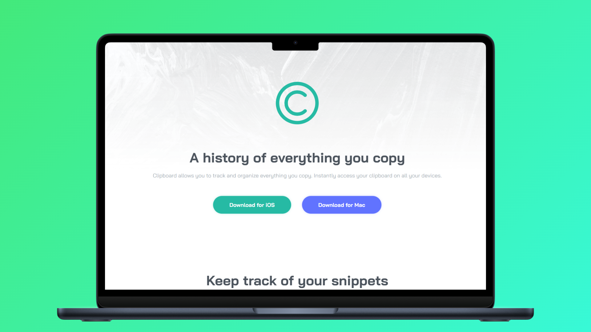

<h1 align="center">Clipboard Landing Page 📋</h1>

<p align="left">
  <a href="README_ES.md" target="_blank">
    Ver README en Español
  </a>
</p>

<p>This repository contains my implementation of the "Clipboard Landing Page" challenge by Frontend Mentor. The main goal of this project was to improve my skills in HTML and CSS by building a responsive landing page using Flexbox and the BEM (Block Element Modifier) methodology. It also includes hover states for interactive elements, enhancing the user experience.</p>
<hr>

<h1 align="center">Technologies Used</h1>
<div align="center">
  
  
</div>
<hr>

<h1 align="center">Objective</h1>
<ul>
  <li>Apply <b>Flexbox</b> to build responsive layouts efficiently.</li>
  <li>Use the <b>BEM methodology</b> to maintain clean and scalable CSS.</li>
  <li>Implement <b>hover states</b> to add interactivity to the UI.</li>
</ul>
<hr>

<h1 align="center">Main Features</h1>
<ul>
  <li><b>Responsive Design:</b> Adapted for different screen sizes using Flexbox.</li>
  <li><b>Flexbox Layouts:</b> Practical implementation of Flexbox for structure and alignment.</li>
  <li><b>BEM Naming Convention:</b> Clean and maintainable CSS with structured class names.</li>
  <li><b>Hover Effects:</b> Interactive UI elements that respond to user actions.</li>
</ul>
<hr>

<h1 align="center">Skills Acquired</h1>
<ul>
  <li>Improved semantic HTML and CSS organization.</li>
  <li>Hands-on experience with Flexbox for responsive design.</li>
  <li>Practical use of BEM methodology in real-world styling.</li>
  <li>Enhanced interactivity using CSS hover states.</li>
</ul>
<hr>

<h1 align="center">How to Use</h1>

1. Clone this repository to your local machine:
   ```sh
   git clone https://github.com/jordanmedinaortiz/clipboard-landing-page.git
   cd clipboard-landing-page
2. Open the project:

<ul>
  <li>Open the <code>index.html</code> file in your preferred browser.</li>
  <li>Explore the design and inspect the HTML, CSS, Flexbox, and BEM implementation.</li>
</ul>
<p>You can view a live demo of the project <a href="https://jordanmedinaortiz.github.io/clipboard-landing-page/">here</a>.</p>

