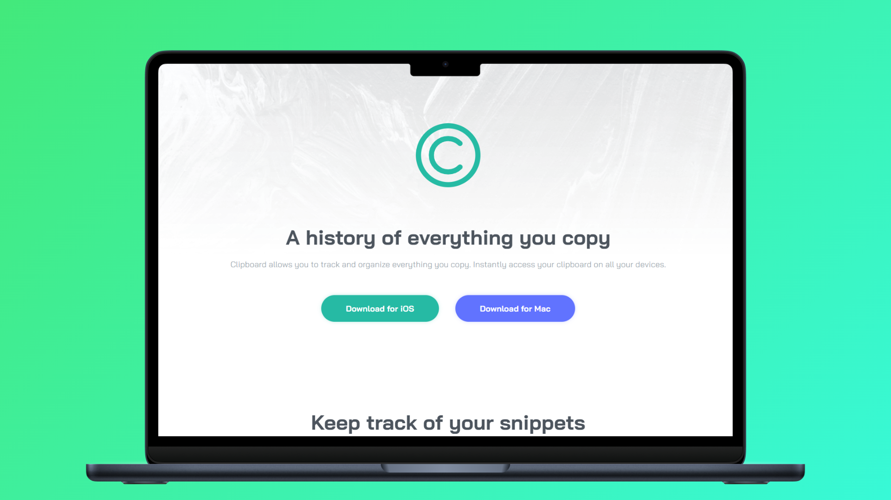

<h1 align="center">Clipboard Landing Page 📋</h1>

<p align="left">
  <a href="README.md" target="_blank">
    View README in English
  </a>
</p>

<p>Este repositorio contiene mi implementación del reto "Clipboard Landing Page" de Frontend Mentor. El objetivo principal de este proyecto fue mejorar mis habilidades en HTML y CSS construyendo una página de aterrizaje responsiva con Flexbox y la metodología BEM (Block Element Modifier). También incluye estados de hover para elementos interactivos, mejorando la experiencia del usuario.</p>
<hr>

<h1 align="center">Tecnologías Utilizadas</h1>
<div align="center">
  
  
</div>
<hr>

<h1 align="center">Objetivo</h1>
<ul>
  <li>Aplicar <b>Flexbox</b> para construir diseños responsivos de manera eficiente.</li>
  <li>Usar la <b>metodología BEM</b> para mantener un CSS limpio y escalable.</li>
  <li>Implementar <b>estados de hover</b> para añadir interactividad a la interfaz.</li>
</ul>
<hr>

<h1 align="center">Características Principales</h1>
<ul>
  <li><b>Diseño Responsivo:</b> Adaptado para distintos tamaños de pantalla con Flexbox.</li>
  <li><b>Layouts con Flexbox:</b> Implementación práctica de Flexbox para estructura y alineación.</li>
  <li><b>Convención BEM:</b> CSS claro y mantenible con nombres de clases estructurados.</li>
  <li><b>Efectos Hover:</b> Elementos interactivos que responden a las acciones del usuario.</li>
</ul>
<hr>

<h1 align="center">Aprendizajes Adquiridos</h1>
<ul>
  <li>Mejora en la organización del HTML semántico y CSS.</li>
  <li>Experiencia práctica con Flexbox para diseño responsivo.</li>
  <li>Uso de la metodología BEM en la estilización de componentes.</li>
  <li>Incremento de la interactividad con estados de hover en CSS.</li>
</ul>
<hr>

<h1 align="center">Instrucciones de Uso</h1>

1. Clona este repositorio a tu máquina local:
   ```sh
   git clone https://github.com/jordanmedinaortiz/clipboard-landing-page.git
   cd clipboard-landing-page
2. Abre el proyecto:
<ul>
  <li>Abre el archivo <code>index.html</code> en tu navegador web preferido.</li>
  <li>Explora el diseño e inspecciona la implementación de HTML, CSS, Flexbox y BEM.</li>
</ul>
<p>Puedes ver una demostración en vivo del proyecto <a href="https://jordanmedinaortiz.github.io/clipboard-landing-page/">aquí</a>.</p>

